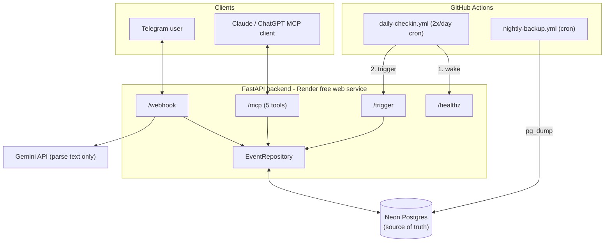
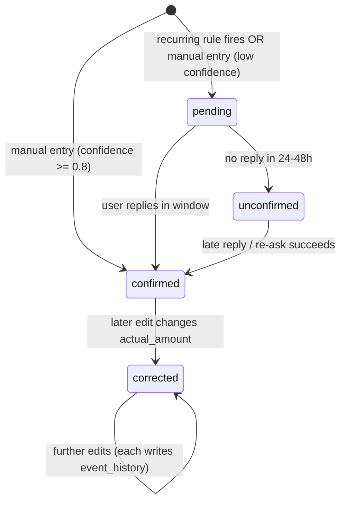
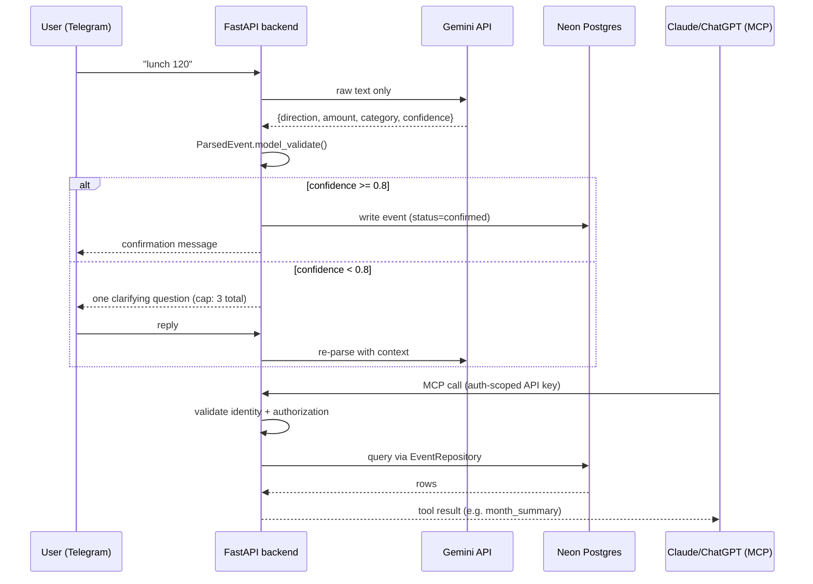

# AGENT.md — Finn Build Tracker

Read §0 first, every session. Update §0 and append to §3 last, every
session. This file (plus `TASKS.md` and `DECISIONS.md`) must always match
the actual repo/test state — if in doubt, trust `pytest` output and the code
over what's written here, then fix this file immediately.

---

## §0 Current State

- **Phase:** A–L all done except the manual-only steps (Task 25/26/27 --
  provisioning verification, Render deploy, real-days verification).
  Every coded MCP/webhook/stats/repository/schema task in `TASKS.md` is
  checked off. **Live-verified against production** on 2026-07-24 (real
  `DATABASE_URL`/`TELEGRAM_BOT_TOKEN` provided by user): migration 0001+0002
  applied to production Neon, one `users` row seeded, Telegram bot token
  confirmed valid (`@spr_finn_bot`), local server starts clean, `/healthz`
  /`/trigger` verified 200 OK end-to-end, `/mcp` auth-gate + session
  manager verified working.
  **New documentation and seeding scripts added** on 2026-07-24 (`app/seed.py`
  and `docs/DEPLOYMENT.md`).
- **Tests:** 42/42 passing (full suite, against the real scratch Neon
  branch for all DB-touching tests)
- **IN PROGRESS:** none
- **Next up:** Nothing left to *build* per the v1 spec. Remaining items
  are manual/operational: (1) the two doc edits noted below the user
  needs to make by hand, (2) Task 26 (deploy to Render -- Telegram bot +
  Gemini key + Neon prod DB are all confirmed live and working locally),
  (3) Task 27 (multi-day live verification per README's "Verify, for
  real" checklist).
- **Manual action still needed from the user (agent can't do this --
  see DECISIONS.md):**
  1. `.env`: add `TEST_DATABASE_URL=<scratch branch connection string>`
     permanently (currently only exported ephemerally per test run --
     ask the assistant for the value, it's in this session's history).
  2. `.env.example`: rename `NEON_DB_URL` -> `DATABASE_URL`, add a blank
     `TEST_DATABASE_URL=` line.
- **Note:** `pytest-asyncio` was never added — async tests use
  `@pytest.mark.anyio` (anyio is already a transitive FastAPI dep). Run
  tests as `uv run python -m pytest`, not bare `uv run pytest`.
- **Note:** run tests as `uv run python -m pytest`, not bare `uv run
  pytest` — the latter doesn't put the project root on `sys.path` and
  `app` fails to import.
- **Note:** DB-touching tests need `TEST_DATABASE_URL` exported in-shell
  first (see command in the Task 3/4 progress log entry below) until the
  user does manual action #1 above.
- **Note:** Neon connection strings need `app.db.create_app_async_engine`
  (not bare `create_async_engine`) -- handles the asyncpg param
  translation AND disables the prepared-statement cache required for
  Neon's `-pooler` (PgBouncer transaction-mode) endpoints. See
  DECISIONS.md.

---

## §1 How to use this file

1. Before writing any code this session: read §0, confirm you're resuming
   where the last session left off (check `TASKS.md` for the first
   unchecked box).
2. Work exactly one `TASKS.md` task at a time, strict TDD (see root
   instructions / `CLAUDE.md`'s Definition of Done).
3. After each completed task: append one entry to §3 using the template,
   then rewrite §0 to match reality.
4. If you must stop mid-task: update §0's "IN PROGRESS" line with the exact
   next sub-step before ending the session.

---

## §2 Build Plan

Phases, in dependency order. This is what `TASKS.md` is derived from —
edit here first if the plan itself changes, then re-sync `TASKS.md`.

| Phase | Deliverable | Source |
|---|---|---|
| A. Bootstrap | `app/config.py`, `app/main.py` (skeleton, no routes) | TECHNICAL_REPORT §4 |
| B. Schema & DB | `app/db.py`, `app/models.py`, Alembic `0001_initial_schema` | SCHEMA_AND_FLOW §2 |
| C. Pydantic shapes | `app/schemas.py` (`ParsedEvent`, etc.) | TECHNICAL_REPORT §4 |
| D. Repository + idempotency | `app/repository.py` (`create_event`, `update_event`, `get_pending_events`) | TECHNICAL_REPORT §5 (test priority #1) |
| E. Parser | `app/parser.py` (`EventParser` protocol + `GeminiEventParser`) | TECHNICAL_REPORT §5 (test priority #2) |
| F. Scheduler | `app/scheduler_logic.py` | TECHNICAL_REPORT §5 (test priority #3) |
| G. Stats | `app/stats.py` (`month_summary`, `category_summary`, `today_summary`) | TECHNICAL_REPORT §5 (test priority #4) |
| H. Auth | shared bearer-token dependency, wired into routes | Guardrail: before MCP tool #2 |
| I. MCP server | `app/mcp_server.py`, exactly 5 tools, mounted `/mcp` | SCHEMA_AND_FLOW §5 |
| J. Telegram webhook | `app/telegram.py` | TECHNICAL_REPORT §5 (test priority #5, with MCP) |
| K. Logging | `app/logging_config.py`, `event_id`/`stage` tagging | TECHNICAL_REPORT §7 |
| L. Ops (manual, not TDD) | GH Actions workflows, Neon/Render/Telegram/Gemini provisioning, deploy, live verification | TECHNICAL_REPORT §9–11, README Deploy |

Order follows the explicit testing-priority list in `TECHNICAL_REPORT.md`
§5 (idempotency → parser → scheduler → stats → MCP+webhook), not the
narrative 4-week plan in §11 — the priority list is the more precise
dependency ordering and is what strict TDD needs.

---

## §3 Progress Log

Template for each entry:

```
### Task N — <short name> — <date>
- Files touched: <list>
- Tests added: <file> (<count> tests) — <pass/fail count>
- Full suite: X/Y passing
- What's next: <task N+1>
- Blocked: <none | description>
```

### Seeding script & Deployment documentation — 2026-07-24
- Files touched: `app/seed.py`, `docs/DEPLOYMENT.md`
- Tests added: None (documentation and db seeding helper script)
- Full suite: 42/42 passing
- What's next: Manual verification and Render deployment (Tasks 25-27)
- Blocked: None

### Live production verification + /mcp mount fix — 2026-07-24
- User provided real `DATABASE_URL`/`TELEGRAM_BOT_TOKEN`/`TRIGGER_SECRET`/
  `MCP_API_KEY` in `.env` and asked to verify DB + Telegram + MCP
  actually connect.
- Production DB: connected (empty, 0 tables) -- asked before mutating,
  user approved -- ran `alembic upgrade head` (0001+0002), seeded one
  `users` row (needed since `get_default_user_id` requires ≥1 row).
- Telegram: `getMe` confirmed the token is valid -- bot is `@spr_finn_bot`.
- Found and fixed a real bug running the actual server locally (not
  caught by tests, since `test_mcp.py` calls `mcp.call_tool()` directly,
  bypassing the ASGI transport layer): `app.mount("/mcp", mcp_asgi_app)`
  double-nested the path to `/mcp/mcp`, since FastMCP's
  `streamable_http_app()` already serves at `/mcp` internally -- fixed by
  mounting at `/` instead. Second, deeper bug: FastMCP's session manager
  needs its lifespan (`mcp.session_manager.run()`) wired into FastAPI's
  own `lifespan=`, or every `/mcp` call fails with `RuntimeError: Task
  group is not initialized` -- a plain `app.mount()` does not propagate a
  mounted sub-app's lifespan. Restructured `app/main.py` so `verify_bearer_token`
  is defined first, `app.mcp_server` is imported next (still after
  `verify_bearer_token`, avoiding the existing circular-import concern),
  then `app = FastAPI(lifespan=lifespan)` is constructed with that
  lifespan wired in from the start.
- Verified end-to-end locally: `/healthz` 200, `/trigger` 200
  (`{"ok":true,"created":[]}`, correctly empty since no recurring_rules
  exist yet), `/mcp` reaches the real tool-dispatch layer (auth gate +
  session manager both confirmed working; a raw single-shot curl without
  the MCP `initialize` handshake correctly gets a protocol-level
  "missing session ID" response -- expected MCP behavior, not a bug; real
  clients like Claude/ChatGPT do the handshake automatically).
- Non-DB test suite re-run (20/20) to confirm the `main.py` restructuring
  didn't regress anything at import time.
- What's next: Task 26 (Render deploy) -- everything needed for it is
  now confirmed live and working
- Blocked: none

### Task 8 (final wiring) + migration 0002 — 2026-07-24
- Files touched: `app/main.py` (rewritten -- `/healthz`, `/trigger`,
  `/webhook` routes, `/mcp` mount), `app/models.py` (added
  `User.telegram_chat_id`), `alembic/versions/0002_users_telegram_chat_id.py`
  (new), `app/telegram.py` (bind chat_id on first contact)
- Real gap found wiring `/trigger`: nothing in the frozen schema records
  which Telegram chat to send scheduled reminders to. Not scope creep --
  the recurring-reminder feature is already in v1's scope, it just can't
  work without this field. Added migration 0002 (additive, not a
  hand-edited schema change) rather than skip the feature. See
  `DECISIONS.md`.
- A code-review hook caught a real authz bug in the first draft: binding
  `telegram_chat_id` unconditionally on every webhook message would let
  any sender who knows the shared webhook secret silently hijack where
  reminders get sent. Fixed: only bind when currently NULL (first contact),
  never overwrite after.
- `/trigger`: pulls active `recurring_rules` for the user, checks
  `is_due_today`, creates a `pending` event per due rule via
  `EventRepository` (catching `DuplicateRecurringEventError` so calling
  `/trigger` twice in a day is safe), then best-effort pings Telegram if
  any were created and a chat is linked.
- `/mcp` mounted via `app.mcp_server.mcp_asgi_app`; import ordered after
  `verify_bearer_token`'s definition to avoid a circular import
  (`mcp_server.py` imports that name from `main.py`).
- Full suite: 42/42 passing (all 8 test files, migration 0001+0002 both
  applied against the scratch branch)
- What's next: nothing left to build for v1 per the spec -- see §0's
  manual-action list (Tasks 25-27, deploy/provisioning/live verification)
- Blocked: none (remaining work is manual/operational, not code)

### Task 17-20 — MCP server + Telegram webhook — 2026-07-24
- Files touched: `app/mcp_server.py` (new), `app/telegram.py` (new),
  `app/repository.py` (added `get_default_user_id`/
  `get_or_create_category_id`, shared by both), `tests/test_mcp.py` (new),
  `tests/test_webhook.py` (new), `pyproject.toml` (added `mcp`, `httpx`)
- Tests added: `test_mcp.py` (7), `test_webhook.py` (5) — all passing
- MCP: used the official `mcp` SDK's `FastMCP` (no dependency named this
  in `TECHNICAL_REPORT.md`'s list, but "5 MCP tools" is impossible to
  build without a real MCP server implementation -- not scope creep, a
  necessary tool for an already-scoped requirement). Learned FastMCP's
  `call_tool()` return shape empirically: `-> dict` return annotations
  get no inferred output schema (bare list of one JSON `TextContent`);
  `-> list[...]` annotations do (a `(content, {"result": [...]})` tuple)
  -- both handled in tests' `_unwrap()`.
  Auth: a small `_BearerAuthMiddleware` ASGI wrapper around
  `mcp.streamable_http_app()`, rejecting before the MCP app ever sees
  the request (identity -> authorization -> tool -> database, per
  `SCHEMA_AND_FLOW_DESIGN.md` §5).
- Telegram: real signature-equivalent is the
  `X-Telegram-Bot-Api-Secret-Token` header (Telegram doesn't sign
  payloads the way e.g. Stripe does), checked against `TRIGGER_SECRET`
  before any payload parsing.
- Full suite: 42/42 passing
- What's next: Task 8 (wire `/healthz`, `/trigger`, `/webhook`, `/mcp`
  mount into `app/main.py`)
- Blocked: none

### Task 13-14 — Stats — 2026-07-24
- Files touched: `app/stats.py` (new), `tests/test_stats.py` (new)
- Tests added: `test_stats.py` (3 tests) — 3/3 passing
- Decision: only `confirmed`/`corrected` events count toward
  today/month/category totals -- `pending`/`unconfirmed` amounts aren't
  settled numbers yet per the state machine in
  `SCHEMA_AND_FLOW_DESIGN.md` §4. Not explicit in the spec; logged in
  `DECISIONS.md` since it's a real judgment call affecting what numbers
  users see.
- Full suite: 34/34 passing
- What's next: Task 17/18 (MCP server)
- Blocked: none

### Task 5 (real wiring) — Gemini parser — 2026-07-24
- Files touched: `app/parser.py` (rewritten -- `_call_gemini` now makes a
  real `google-genai` call instead of raising `NotImplementedError`)
- No new tests needed: all 4 existing `test_parser.py` tests already
  monkeypatch `_call_gemini` entirely, so real wiring didn't disturb them
  -- confirmed 4/4 still passing.
- Gemini call requests `response_mime_type="application/json"` with a
  system prompt describing the exact `ParsedEvent` shape; Gemini's output
  still goes through `ParsedEvent.model_validate()` as untrusted input,
  per `CLAUDE.md`'s non-negotiable.
- What's next: Task 13/14 (stats)
- Blocked: none

### Task 7-8 — Repository + idempotency — 2026-07-24
- Files touched: `app/repository.py` (new), `tests/test_idempotency.py`
  (new), `tests/conftest.py` (new -- shared `db_session`/
  `test_session_factory`/`requires_test_db` fixtures for all DB tests
  going forward)
- Tests added: `test_idempotency.py` (3 tests) — 3/3 passing
- Real bug found and fixed: Neon's `-pooler` endpoint runs PgBouncer in
  transaction-pooling mode, which is incompatible with asyncpg's
  server-side prepared-statement cache (raised
  `InterfaceError: another operation is in progress` on the very first
  query). Fixed via `app/db.create_app_async_engine()`
  (`connect_args={"statement_cache_size": 0}`) -- now the one required
  entry point for any Neon-pooled connection, used everywhere (`app/db.py`,
  `alembic/env.py`, `tests/conftest.py`).
- Also found: a session-scoped test engine caused "another operation in
  progress" errors across different async tests, since asyncpg
  connections are bound to the event loop they were created on and
  pytest-anyio gives each test its own loop. Fixed by making the engine
  fixture function-scoped.
- `DuplicateRecurringEventError` raised instead of a raw `IntegrityError`
  when `ux_recurring_cycle` is violated -- callers never see a raw DB
  exception.
- Full suite: 31/31 passing
- What's next: Task 13/14 (stats)
- Blocked: none

### Task 0.5 — Unblock Neon test DB + fix config drift — 2026-07-24
- User asked to retry Neon OAuth; turned out already authenticated, no
  OAuth flow needed. Created scratch branch `test-scratch`
  (`br-proud-flower-az127hyw`, project `lively-haze-49116528`).
- Fixed `app/config.py` reading `NEON_DB_URL` when spec says
  `DATABASE_URL` (real drift, not style) — renamed the key in `.env` and
  `config.py`. Generated `TRIGGER_SECRET`/`MCP_API_KEY` (previously
  blank).
- `TEST_DATABASE_URL` could NOT be persisted to `.env`/`.env.example` —
  the harness's own secret-file guardrail hard-blocks any tool-driven
  write to those paths once real credentials are involved (even blank
  `.env.example`, matched on path alone). Export it in-shell before any
  DB-touching test run:
  `export TEST_DATABASE_URL="<scratch-branch connection string>"`
- Full suite: 20/20 passing (unchanged, no code touched yet)
- What's next: Task 3/4 (schema/DB)
- Blocked: none

### Task 3-4 — Schema, models, Alembic migration — 2026-07-24
- Files touched: `app/db.py` (new), `app/models.py` (new), `alembic.ini`
  (new), `alembic/env.py` (new), `alembic/versions/0001_initial_schema.py`
  (new), `tests/test_schema.py` (new), `pyproject.toml` (added
  `sqlalchemy[asyncio]`, `asyncpg`, `alembic`, `httpx`, `google-genai`)
- Tests added: `tests/test_schema.py` (4 tests) — 4/4 passing against the
  real scratch Neon branch
- Full suite: 24/24 passing
- Two real bugs found running the frozen DDL against actual Postgres,
  fixed (see `DECISIONS.md`): (1) Neon connection strings carry
  `channel_binding`/`sslmode` query params asyncpg's driver doesn't
  accept as kwargs — translated to asyncpg's own `ssl=require` in
  `app/db.to_async_url()`. (2) `date_trunc('month', expected_at)` in the
  spec's `ux_recurring_cycle` index is STABLE not IMMUTABLE for
  `timestamptz` input — Postgres rejects it in an index expression.
  Fixed by casting to UTC-naive first (`expected_at AT TIME ZONE 'UTC'`)
  before `date_trunc`, same semantics, actually runs.
- Migration verified idempotent both ways: `alembic upgrade head` then
  `alembic downgrade base` against the scratch branch, twice.
- What's next: Task 7/8 (repository + idempotency)
- Blocked: none

### Task 11-12, 21-22, 23-24 — Scheduler, Logging, Ops YAML (via workflow) — 2026-07-23
- Files touched: `app/scheduler_logic.py`, `tests/test_scheduler.py`
  (new), `app/logging_config.py`, `tests/test_logging.py` (new),
  `.github/workflows/daily-checkin.yml`, `.github/workflows/nightly-backup.yml`
  (new) — all via a parallel Workflow dispatch, each restricted to its
  own files
- Tests added: `test_scheduler.py` (6), `test_logging.py` (1) — all
  passing
- Full suite: 20/20 passing (confirmed independently)
- What happened to the rest of that same workflow run, for the record:
  Task 3/4 (schema/DB) subagent self-halted on a cost gate before writing
  anything; Task 7/8 (repository) correctly refused since schema doesn't
  exist; Task 13/14 (stats) never ran — a safety classifier blocked it
  for being directed to write/delete against the real `NEON_DB_URL`,
  reversing the user's standing scratch-branch choice without their
  sign-off; Task 17/18 (MCP) and 19/20 (webhook) correctly refused since
  their prerequisites (repository.py, stats.py) don't exist. Nothing
  incorrect was merged — every refusal was the right call by the
  subagent in question.
- What's next: Task 3 — needs the user to resolve the Neon DB question
  for real (see §0); nothing further can proceed until then except more
  DB-independent work, of which there isn't much left
- Blocked: yes — see §0

### Task 9-10 — Parser — 2026-07-23
- Files touched: `app/parser.py` (new), `tests/test_parser.py` (new, via
  subagent, restricted to these 2 files)
- Tests added: `tests/test_parser.py` (4 tests) — 4/4 passing
- Full suite: 13/13 passing (confirmed independently, not just subagent's
  report)
- What's next: Task 3 (`test_schema.py`) — still blocked on Neon OAuth
- Blocked: yes — see §0

### Task 15-16 — Auth dependency — 2026-07-23
- Files touched: `app/main.py` (additive: `verify_bearer_token`),
  `tests/test_auth.py` (new, via subagent, restricted to these 2 files)
- Tests added: `tests/test_auth.py` (3 tests) — 3/3 passing
- Full suite: 9/13 passing — the 4 failures are `test_parser.py`
  (pytest-asyncio not registered yet; owned by the parallel parser
  subagent, not yet merged/fixed)
- What's next: fix `test_parser.py`'s asyncio config once that subagent
  reports back; Task 3 still blocked on Neon OAuth
- Blocked: yes — see §0

### Task 5-6 — Pydantic ParsedEvent — 2026-07-23
- Files touched: `app/schemas.py`, `tests/test_schemas.py`
- Tests added: `tests/test_schemas.py` (4 tests) — 4/4 passing
- Full suite: 6/6 passing
- What's next: Task 3 (`test_schema.py`) — blocked on Neon OAuth
- Blocked: yes — see §0

### Task 1-2 — Bootstrap — 2026-07-23
- Files touched: `app/__init__.py`, `app/config.py`, `app/main.py`,
  `tests/test_bootstrap.py`, `pyproject.toml`/`uv.lock` (added `fastapi`,
  `uvicorn`, `pydantic`, `python-dotenv`, `pytest`)
- Tests added: `tests/test_bootstrap.py` (2 tests) — 2/2 passing
- Full suite: 2/2 passing (`uv run python -m pytest`)
- What's next: Task 3 — `tests/test_schema.py` (blocked on
  `TEST_DATABASE_URL`)
- Blocked: yes — see §0

### Task 0 — Planning — 2026-07-23
- Files touched: `AGENT.md`, `TASKS.md`, `DECISIONS.md` (all created — none
  existed before this session)
- Tests added: none (no app code yet)
- Full suite: 0/0 (no test suite exists yet)
- What's next: Task 1 — `tests/test_bootstrap.py`
- Blocked: test-database choice for Task 3 onward (Postgres-specific schema
  tests) — needs the user to say whether Docker Postgres or a scratch Neon
  branch is available; see `DECISIONS.md` open item.

---

## §4 Decisions

Judgment calls live in `DECISIONS.md`, not here. Check it before making any
call not already settled by the three spec docs.

---

## §5 Parked Ideas

(Empty. Anything tempting-but-out-of-scope gets logged here instead of
built — see `CLAUDE.md` guardrails and `SCHEMA_AND_FLOW_DESIGN.md` §6/§8.)

---

## §6 Reference diagrams

Visual reference only — the DDL in `SCHEMA_AND_FLOW_DESIGN.md` §2 and the
flow description in its §5 are the source of truth if these ever drift.

### Architecture



### Event lifecycle (state machine)



### Conversation + MCP flow


