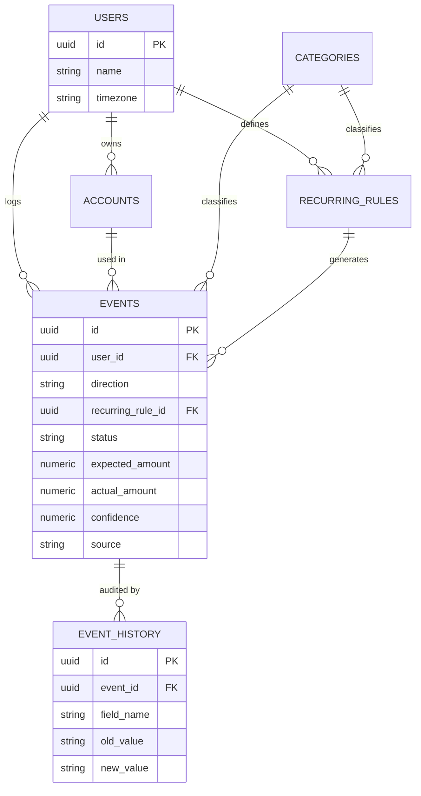

# Personal Finance Tracker — Schema & Flow Design (v1 + Future-Scoped Notes)

**Status:** v1 schema/flow below is frozen for build. The "Future-Scoped
Extensions" section (§8) is design commentary only — none of it gets built
now. It exists so that when the 30-day checkpoint says something earned its
place, the schema doesn't need a rewrite to accommodate it.

---

## 1. What this is

A **scheduled, user-seeded confirmation system**, not automatic bank
detection. Recurring dates (salary, EMI, SIP) are seeded once; the bot pings
inside a date window to confirm/correct. Everything else is logged via
natural-language chat, 2x/day, through the Gemini API. Any MCP-capable
client (Claude, ChatGPT) can query your own data through a scoped MCP
server — the "second opinion" feature.

**Core principle:** everything is an `event`. One table does the work five
would otherwise do.

**Success criterion — the only roadmap that matters for the next 30 days:**
1. Log expenses by chatting naturally
2. Get recurring reminders for salary/EMI/SIP that trigger on the right day
3. See daily/weekly/monthly/category summaries
4. Ask Claude or ChatGPT (via MCP) questions about your own data, securely

---

## 2. Schema (DDL)

```sql
CREATE EXTENSION IF NOT EXISTS "uuid-ossp";

CREATE TABLE users (
    id          UUID PRIMARY KEY DEFAULT uuid_generate_v4(),
    name        TEXT NOT NULL,
    timezone    TEXT NOT NULL DEFAULT 'Asia/Kolkata',
    created_at  TIMESTAMPTZ NOT NULL DEFAULT now()
);

CREATE TABLE accounts (
    id          UUID PRIMARY KEY DEFAULT uuid_generate_v4(),
    user_id     UUID NOT NULL REFERENCES users(id),
    name        TEXT NOT NULL,               -- 'HDFC Savings', 'Cash', 'GPay'
    kind        TEXT NOT NULL,                -- bank / cash / upi / credit_card
    created_at  TIMESTAMPTZ NOT NULL DEFAULT now()
);

-- Global, not per-user, until real usage proves otherwise (see section 8)
CREATE TABLE categories (
    id          UUID PRIMARY KEY DEFAULT uuid_generate_v4(),
    name        TEXT NOT NULL UNIQUE,          -- 'Food', 'Salary', 'Transport'...
    direction   TEXT NOT NULL CHECK (direction IN ('credit','debit','either'))
);

CREATE TABLE recurring_rules (
    id               UUID PRIMARY KEY DEFAULT uuid_generate_v4(),
    user_id          UUID NOT NULL REFERENCES users(id),
    label            TEXT NOT NULL,            -- 'Salary', 'Home loan EMI', 'SIP - Nifty50'
    category_id      UUID NOT NULL REFERENCES categories(id),
    expected_amount  NUMERIC(12,2) NOT NULL,
    direction        TEXT NOT NULL CHECK (direction IN ('credit','debit')),
    day_of_month     SMALLINT NOT NULL CHECK (day_of_month BETWEEN 1 AND 31),
    window_days      SMALLINT NOT NULL DEFAULT 2,   -- +/- tolerance around day_of_month
    active           BOOLEAN NOT NULL DEFAULT true,
    active_from      DATE NOT NULL DEFAULT CURRENT_DATE,
    active_until     DATE
);

-- The single heart of the system. Everything is an event.
CREATE TABLE events (
    id                 UUID PRIMARY KEY DEFAULT uuid_generate_v4(),
    user_id            UUID NOT NULL REFERENCES users(id),

    -- WHAT kind of movement, not WHY -- category carries the "why"
    direction          TEXT NOT NULL CHECK (direction IN ('credit','debit')),

    -- links back to the rule that generated this, NULL for manual entries.
    -- this single FK is the "is it recurring" signal -- no separate event_type column.
    recurring_rule_id  UUID REFERENCES recurring_rules(id),

    status             TEXT NOT NULL DEFAULT 'pending'
                        CHECK (status IN ('pending','confirmed','corrected','unconfirmed')),

    expected_amount    NUMERIC(12,2),
    actual_amount      NUMERIC(12,2),

    expected_at        TIMESTAMPTZ,             -- UTC. Convert to user tz at display time only.
    event_at           TIMESTAMPTZ,              -- when it actually happened / was confirmed

    account_id         UUID REFERENCES accounts(id),
    category_id        UUID NOT NULL REFERENCES categories(id),

    source             TEXT NOT NULL CHECK (source IN ('manual','scheduled','import')),
    raw_text           TEXT,                     -- exactly what the user typed
    notes              TEXT,

    confidence         NUMERIC(3,2),              -- Gemini's parse confidence, 0.00-1.00
    metadata           JSONB,                     -- constrained use, see section 8

    version            INT NOT NULL DEFAULT 1,
    created_at         TIMESTAMPTZ NOT NULL DEFAULT now(),
    updated_at         TIMESTAMPTZ NOT NULL DEFAULT now()
);

-- Idempotency: exactly one instance of a given recurring rule per cycle
CREATE UNIQUE INDEX ux_recurring_cycle
    ON events (recurring_rule_id, date_trunc('month', expected_at))
    WHERE recurring_rule_id IS NOT NULL;

-- Immutable audit trail. Corrections never overwrite silently.
CREATE TABLE event_history (
    id           UUID PRIMARY KEY DEFAULT uuid_generate_v4(),
    event_id     UUID NOT NULL REFERENCES events(id),
    field_name   TEXT NOT NULL,
    old_value    TEXT,
    new_value    TEXT,
    reason       TEXT,
    changed_by   TEXT NOT NULL DEFAULT 'user',   -- 'user' | 'system'
    changed_at   TIMESTAMPTZ NOT NULL DEFAULT now()
);

CREATE INDEX idx_events_user_time ON events (user_id, event_at DESC);
CREATE INDEX idx_events_status    ON events (user_id, status) WHERE status IN ('pending','unconfirmed');
```

### Design decisions baked into this DDL
- **UUID + `TIMESTAMPTZ` everywhere, stored UTC.** Timezone conversion
  happens at display time using `users.timezone`, never at write time.
- **No separate `event_type` column.** Whether an event is recurring is
  answered by `recurring_rule_id IS NOT NULL` — one signal, not two that can
  disagree.
- **`confidence` on every event.** Below a threshold (start at 0.8), the
  conversation layer asks a follow-up instead of silently logging.
- **Mutable `events` + append-only `event_history`** for corrections —
  simple reporting queries, full traceability.
- **Idempotency enforced at the database level** via a partial unique
  index, not just application-code checks that can race under retries.
- **`categories` stays global**, not `user_id`-scoped — single-user system
  today; cheap to add later, not worth the complexity now.
- **`metadata JSONB`** exists but is constrained: only genuinely optional,
  non-queryable annotation (merchant name, free-text tag). The moment a
  query filters on it, that's the signal to promote it to a real column.

---

## 3. Entity relationships



---

## 4. Event lifecycle (state machine)

```
              recurring_rules cron fires (day_of_month +/- window_days)
                                  |
                                  v
                            [ pending ]  <-- also created manually by chat, status=confirmed directly
                                  |
                 +----------------+----------------+
                 |                                  |
        user replies in window            no reply within 24-48h
                 |                                  |
                 v                                  v
            [ confirmed ]                     [ unconfirmed ]
                 |                          (visible in stats as a gap,
                 |                           never silently zeroed;
                 |                           one re-ask, then stays flagged)
                 v
     later edit changes actual_amount
                 |
                 v
            [ corrected ]  --> writes a row to event_history, never overwrites silently
```

**Rules encoded by this diagram:**
- `pending → confirmed` is the happy path — most manual chat entries skip
  straight to `confirmed` since there's nothing to wait on.
- `pending → unconfirmed` is a first-class, visible state — the nightly job
  that flags stale `pending` rows must never leave them `pending` forever,
  and must never treat silence as `actual_amount = 0`.
- `confirmed → corrected` is the only path that touches `event_history` —
  every field change writes `old_value → new_value` there before the
  `events` row itself is updated.

---

## 5. Conversation flow (daily check-in) + MCP flow

```
 02:00 local          14:00 local           any time
      |                    |                      |
      v                    v                      v
 [scheduler]          [scheduler]           [user-initiated]
      |                    |                      |
      +--- due today? -----+                      |
      |  yes: lead with               "Lunch 120" / "Friend gave 500, no reason"
      |  recurring event                           |
      v                                            v
        "Salary in yet? Anything else?"     Gemini parses -> JSON
                    |                               |
                    v                               v
           user free-text reply          {type, amount, category, confidence}
                    |                               |
                    +---------------+----------------+
                                    v
                     confidence >= 0.8 ? --no--> ask ONE clarifying question
                                    |                    (hard cap: 3 total per event)
                                   yes
                                    v
                          write to events table
                          (status per section 4)
                                    |
                                    v
                          stats views recompute
                          on next read (plain SQL,
                          no precompute needed yet)
```

Hard constraints on this flow, because they determine whether the tool
survives past week two:
- **Never more than 3 follow-up questions per event.** If the parse needs a
  4th question, log as `unconfirmed` with a note rather than interrogate.
- **Silence is a visible gap, not an assumed zero.**
- **On days a recurring event is due, merge it into the same ping** — never
  send two separate money messages the same day.

### MCP server — exactly five tools for v1

```
log_event(text)              -> parses + writes one event
today_summary()               -> today's confirmed events, grouped by direction
month_summary(month?)         -> totals by category for the given/current month
category_summary(category)    -> spend trend for one category over time
pending_events()              -> anything awaiting confirmation right now
```

**Security model — build before tool #2, not after:**
- Gemini receives only the raw message text for parsing. Never account
  balances, salary history, or prior months — those stay backend-side.
- The MCP server is scoped to one user via OAuth or a scoped API key. Every
  call: identity → authorization → tool → database. No anonymous access.
- The backend validates every field Gemini returns before it's written —
  the model's output is untrusted input, not a trusted write.

```
   Claude / ChatGPT (dev mode) / any MCP client
                    |
              MCP server (auth-scoped per user)
                    |
              FastAPI backend  <-- all business logic, validation lives here
                 /      \
        Gemini API      PostgreSQL
    (parse text only,   (source of truth,
     no DB access)       stats via plain SQL)
```

---

## 6. Explicitly out of scope for v1

Do not build until the 30-day checkpoint's data says otherwise:
- `people` / `loans` tables — informal loans stay `category = informal_loan`
- `categories.user_id` — single-user system today; add later if ever needed
- Knowledge graph, embeddings, vector search
- SMS/email parsing, Account Aggregator integration, receipt OCR
- Forecasting, cash-flow prediction, investment tracking
- Local-first / swappable-LLM abstraction — build against Gemini directly
- Any MCP tool beyond the five listed (`net_worth`, `goal_status`,
  `predict_cashflow`, etc.)
- `metadata JSONB` used for anything you'd ever query or filter on

Each one earns its place only when real usage demonstrates the need.

---

## 7. What to measure during the 30-day trial

| Metric | Target |
|---|---|
| Daily check-in completion rate | > 80% |
| Average follow-up questions per event | < 2 |
| Time to log an event | < 30 seconds |
| Manual edits after AI parsing | < 10% |
| Missed recurring confirmations | < 5% |
| Duplicate recurring events | 0 |
| MCP tool failures | 0 |

At day 30, review this table plus: which categories were created manually,
which follow-up questions were annoying, whether the MCP tools were ever
actually used. The answers become the next spec — not this document.

---

## 8. Future-Scoped Extensions (design notes only — not v1 work)

These are **not roadmap items**. They're notes on how the v1 schema would
extend *if* the 30-day data justifies it, written now so extension is a
migration, not a rewrite. Nothing here gets built without that evidence.

### 8.1 Per-user categories
If a second user is ever added, `categories` would gain a nullable
`user_id UUID REFERENCES users(id)`, with `NULL` meaning "global default."
Queries would resolve with `COALESCE`-style precedence (user-specific
override, else global). No change needed to `events.category_id` — it
already just points at a category row.

### 8.2 People / informal loans
A `people` table (`id`, `name`, `relationship`, `contact_ref`) and a thin
`loans` table (`id`, `person_id`, `principal`, `direction`, `settled_at`)
would sit alongside `events`, with `events.metadata->>'person_id'` migrated
into a real `person_id` FK column on `events` once it's clear loans are
actually tracked as a distinct concept and not just a category label. This
is the textbook trigger for promoting a JSONB field to a column described
in §2 — don't do it until a query needs to filter on it.

### 8.3 Multi-account reconciliation / bank feeds
If SMS parsing or Account Aggregator integration is ever justified, the
natural seam is `events.source` gaining an `'import'` path that's already
defined in the CHECK constraint today — no schema change needed there. What
would be new: an `import_batches` table (`id`, `source_system`,
`imported_at`, `raw_payload`) and a reconciliation status distinct from the
existing `status` column, since "did this event happen" and "did this
event match a bank feed line" are different questions that a single column
shouldn't try to answer.

### 8.4 Forecasting / cash-flow prediction
Would read `events` + `recurring_rules` as pure input — no new source-of-
-truth tables. A `forecast_snapshots` table (materialized, regenerable,
never authoritative) is the right shape if this is ever built, so a bad
forecast run can never corrupt real transaction history.

### 8.5 Investment tracking
Deliberately not modeled as `events` — buying a mutual fund unit isn't a
credit/debit in the same sense as spending. If ever added, this is a
sibling domain (`holdings`, `nav_history`) that references `accounts` but
does not extend `events`. Trying to force it into the events table would
break the "everything is an event" simplicity that makes v1 work.

### 8.6 Local-first / swappable LLM parser
The `EventParser` protocol in `01_TECHNICAL_REPORT.md` §4 already makes
this a non-event if it ever happens: a second class implementing the same
`parse(text) -> ParsedEvent` contract, selected by the existing
`FEATURES` dict. No schema change at all — this lives entirely in
`app/parser.py`.

### 8.7 Knowledge graph / embeddings / vector search
No natural seam yet. If ever justified (e.g., semantic search over
`raw_text` and `notes`), it would be an additive, read-only index
(`pgvector` column or separate embedding store) computed from existing
`events` rows — never a required write path, so it can be turned off
without breaking the core log/confirm/summarize loop.

**Guiding rule for all of the above:** every extension listed here is
additive to the v1 schema — new tables, new nullable columns, or new
sibling domains — never a redesign of `events`, `recurring_rules`, or the
state machine in §4. If a future need ever seems to require rewriting
those, that's a signal to slow down and re-verify the need is real, not a
signal to start rewriting.
